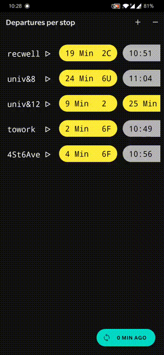
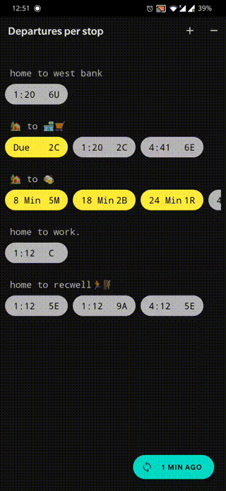
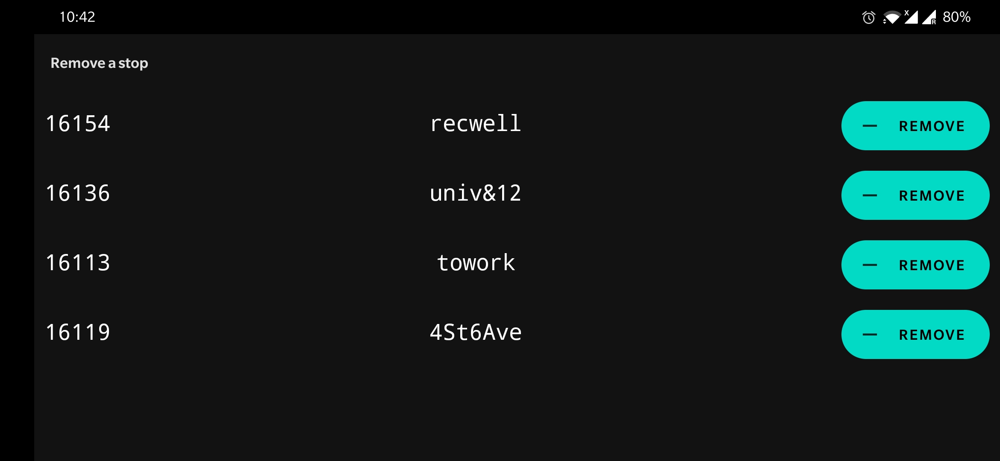
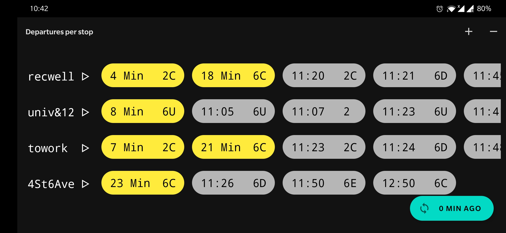

# bussbus

## description
- A simple tool for quickly glancing MetroTransit departures in Minneapolis/St. Paul.

## code
- This is a minimal android project in `Kotlin`.
- Uses MetroTransit public API <https://svc.metrotransit.org/nextrip>.

## documentation
- The documentation for the code is itself.

## usage
- Install the app on an android device.
- Add some stops (using respective stop ids) and give them (unique) names.
- The departures from those stops shall appear.
- Similarly remove stops when not needed.
- The departures are not automatically updated. A sync button on the bottom shows how long ago was the last sync. Press that button to sync again.
- No login required.
- No location permission needed.
- If a stop's departures can not be fetched, its id might be wrong. Try removing and adding it again.

## demonstration
| | |
| --- | --- |
| Adding a stop |  |
| Removing a stop |  |
| Sync |  |

### landscape mode
- Adding a stop

- Removing a stop

- Viewing departures

## roadmap
- [x] Scroll view in stop departures activity.
- [x] Display stop name before requesting departuresList. Useful in case of laggy response.
- [x] Update last sync state in sync() rather than in success callback. Safer choice in case of laggy response.
- [x] Adding a stop.
    - [x] Where can stop ids be found? - Link provided.
    - [x] StopId validation: len == 5 & uniqueness.
    - [x] StopName validation: 0 < name & uniqueness.
    - [x] Db add.
    - [x] finish() on add.
- [x] Read stops from db.
- [x] Updated list on add/remove finish() return.
- [x] Removing a stop.
    - [x] Recycler view.
    - [x] Db remove.
    - [x] finish() on remove.
- [x] Simplify Holder object.
- [x] Inline shared pref commit() & Error check shared pref commit()
- [x] Improve validation comments, Improve messages; add period at the end.
- [x] Remove background pictures if copyrighted.
- [x] Improve styling.
- [x] Decrease num of id references to xml elements.
- [x] Check internet connection.
- [x] Demo.
- [x] Improves validation message display in AddStopActivity. (Uses above keyboard Snackbars)
- [ ] Release on play store and post about it.
- [ ] Simplify last sync x min ago periodic update.
- [ ] Check internet connection idiomatically.
